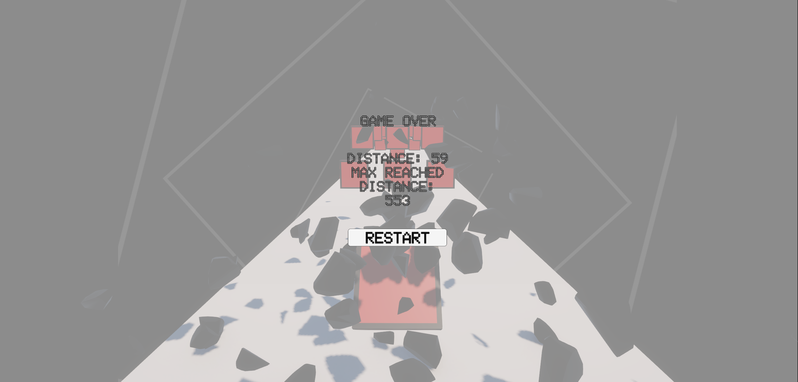

# Balls Runner

Простая 3D раннер-игра на Unity где шарик движется по треку, избегая препятствий.

## Особенности

- Эффект разрушения - при столкновении с препятствием шарик взрывается на осколки
- Кастомный шейдер фона - анимированные растущие квадраты создают туннельный эффект
- Система дистанции - подсчет пройденного расстояния с сохранением рекорда

## Скриншоты

## Видео

## Технологии

Unity, C#, HLSL Shaders, URP